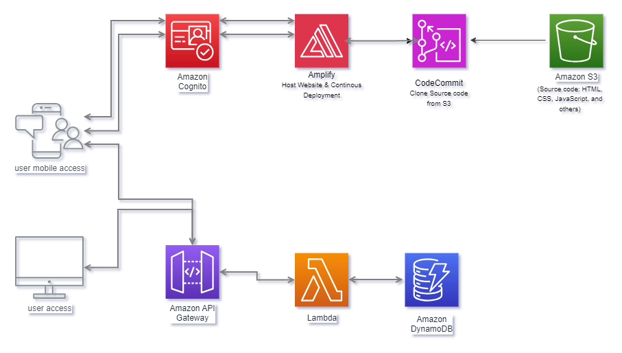

# Ride-Hailing Web App Continuous Delivery Project
## The goal of this project is to build a continous delivery Ride-hailing web application, like Uber; in this case, cars are referred to as Unicorns. It incorporates user registration and login, and Map functionalities that allows users to click on a location and request a unicorn ride. Credit: AWS

<!-- ## Architechture -->

## Project requirements & analysis
### + Text Editor
### + An Account and access to AWS Console
### + Knowledge of AWS Services
### + A free ArcGIS account (arcgis.com)
### + The need to store/update/pull code
### + The need to handle permissions for code
### + The need to host website and make updates
### + User registration and login
### + Ride sharing functionality
### + The need to store/return ride results
### + Invoking ride sharing functionality
