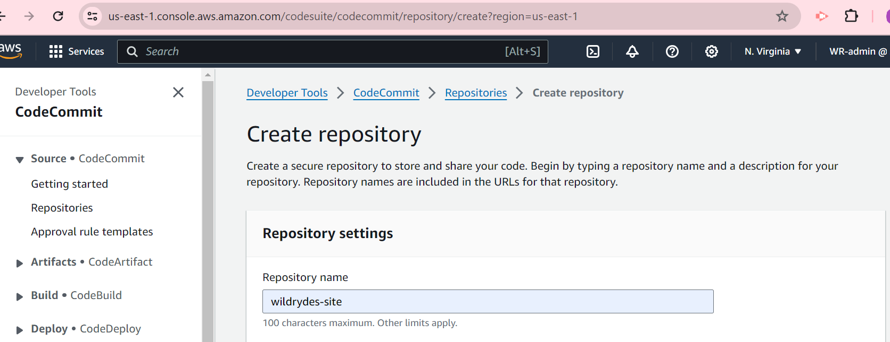
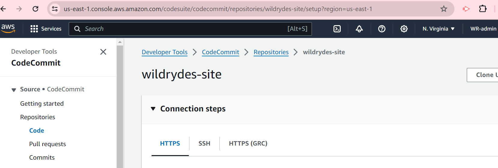
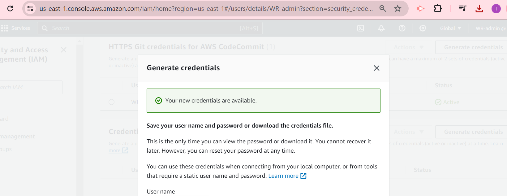
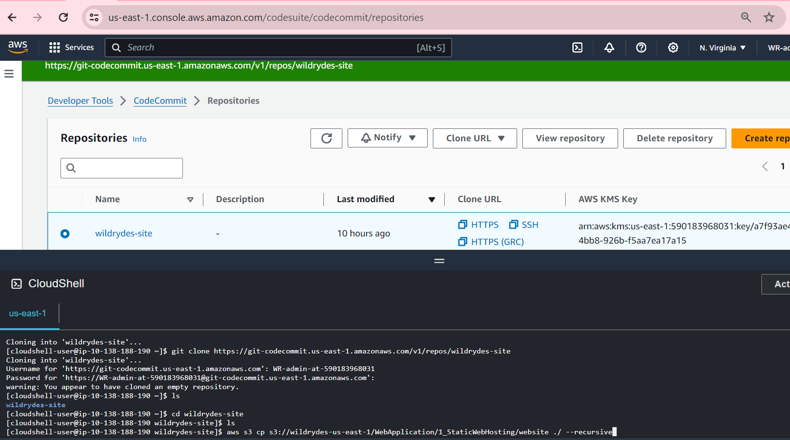
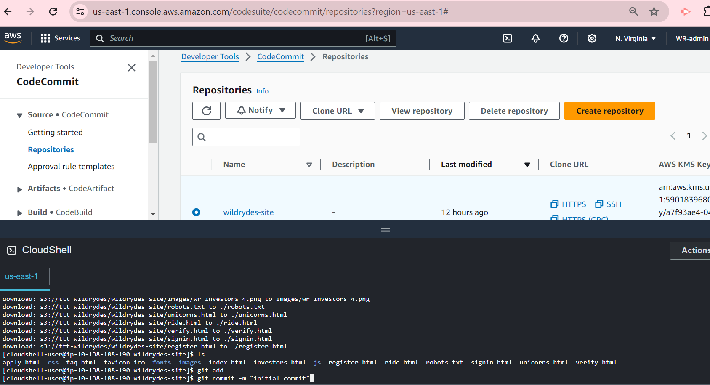
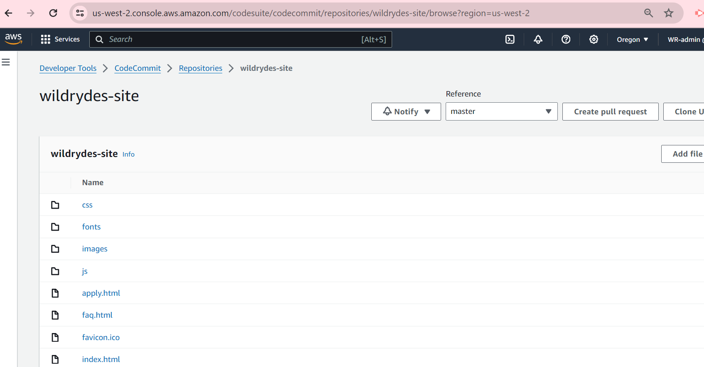
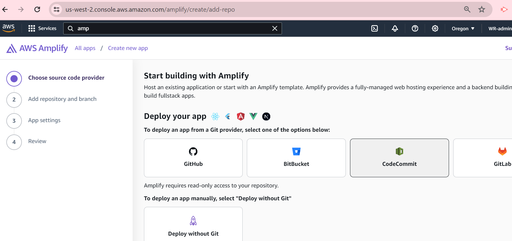
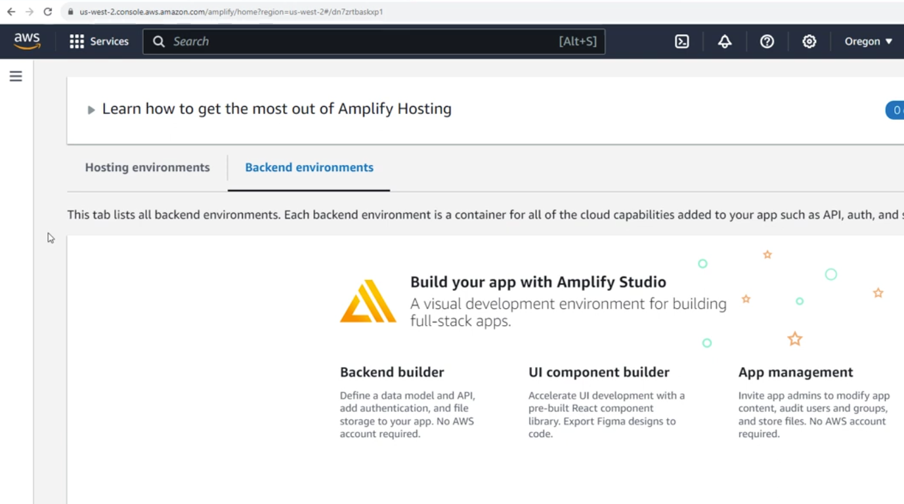
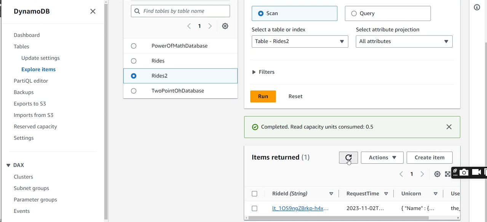

# Ride-Hailing Web App Continuous Delivery Project
### A ficticious company has approached me with a requirement to build a continous delivery Ride-hailing web application, like Uber; in this case, cars are referred to as Unicorns. The application should include user registration and login, and Map functionalities that allow users to click on their current location on the map and request a unicorn ride to pick them up. Credit: AWS

<!-- ## Architechture -->

AWS services used: CodeCommit, Identity & Access Management (IAM), Amplify, Cognito, API Gateway, Lambda and DynamoDB
## Project requirements & analysis
+ An AWS Account and access to the Console
+ Knowledge of the AWS Services
+ A free ArcGIS account (arcgis.com)
+ The need to store/update/pull code
+ The need to handle permissions for code
+ The need to host website and make updates
+ User registration and login
+ Ride sharing functionality
+ The need to store/return ride results
+ Invoking ride sharing functionality

### Code Setup
We use AWS CodeCommit to:
+ store/update/pull the web application source code
+ handle permissions for the source code
+ Side note: There is need to be consistent in the AWS region we are working in.
+ The App source code is made available by AWS in a public S3 bocket
+ We create a CodeCommit Repo:
  -  Create an empty repository in CodeCommit

.
+ Add a policy to your IAM user so that you can access CodeCommit. It is best practise to login as an IAM user with administrative access not with root credentials. 
<!-- Go to IAM> Users> Permissions policy> Add permissions> Attach policies directly> search for AWS CodeCommitPowerUSer> Next> Add permissions -->

.
+ Create the GIT credentials for your IAM user to allow HTTPS connections to CodeCommit 
<!-- IAM>Users>Security credentials>HTTPS Git Credentials for AWS CodeCommit>Generate credentials> Then download the credential -->

.
+ Clone the repository (create an empty folder for future code)
<!-- CodeCommit>Repositories>Create repository> select repo you earlier created>Clone URL>Clone HTTPS>open cloud shell at the top> then type: git clone the url> Then enter the user name & password generated earlier -->

.
+ Copy the project code from the S3 bucket and commit it to the new repo. In cloud shell cd into the empty repo folder and copy source code from S3 to this folder.
<!-- cd wildrydes-site2 > aws s3 cp s3:// (ensure to change the region to your region) then add the files to the git repository, when prompted for email and user name use the details of the IAM user not the details for HTTPS, Commit and push> followed by the HTTPS credentials -->

<!-- We can then view the source code files at CodeCommit> Repositories> Wildrydes-site -->

.
### Host the Website & allow continuous delivery
We use AWS Amplify to:
+ connect with the CodeCommit repository and pull the source code
+ host the website so that user can easily access it.
+ easily deliver updates to the website
<!-- Applify>New app> Host app> select CodeCommit>continue>select the repo created earlier> click next> ensure to click the checkbox to allow AWS applify to automatically deploy all files..as continous deployment> click create a new service role>next>review>save and deploy -->

<!-- Amplify is serverless and no need to provision EC2 servers-->

.
+ Test that continous deployment is working by making some changes to the source code and see if amplify automatically effect the changes
<!-- CodeCommit> Repositories>repo name> Edit index.html> Update some of the text>Commit the changes with Author name, email -->

### Implement User Access
We use AWS Cognito to:
+ enable users to register and login with their credential or external identity systems.
+ enable user authentication
 Amplify studio lets us setup cognito on the deployed app easily: But first we setup a user pool from  cognito be performing configuration changes in amplify <!--.i.e Amazon Cognito> User pools> Create user pool> Choose attibutes that users will use to sign in (User name, Email, Phone number)>Next>Configure Security requirements(Password Policy)>MFA setup>defaults for user account recovery>Next>Configure sign-up experience> Enable self registration and maintain defaults> Next> Configure message delivery: Email Provider(send with congito to test)> defaults for from and reply to emails adderss>Next>Integrate your app: add user pool name, add app client name, the rest defaults>Next> Review and create: Create user pool> Access user pool and copy User pool ID, Client ID under - app clients and analytics - App authentication -->

.
+ Then update the config file in the application to point to this user pool.  
<!-- CodeCommit>Code>js>config.js> Edit and update userpoolid, clientid and region the commit changes -->

+ Refresh the web page and test the login functionality with email and password. The Cognito email service will send a confirmation email with verification code to the registered email to login. Cognito user pool takes care of signin functionality to the app. After successfully login it takes you to the ride.html page that has the map functionality. Copy the authentication token on the page into your note pade for use later.

### Implemment Ride Sharing Functionality & Database to store and return ride results
+ A user will request a ride and then a unicorn is sent to their location. Here we use Lamda that allows code to runs serverlessly following some trigger. In this case, the function to be trigger everytime a user requests a unicorn ride.
+ We also use dynamoDB, a Key-value ("NoSQL") database. User request a ride that will invoke a lamda function which select a unicorn from the fleet and record that request in the dynamoDB table and respond at the front with the details of the unicorn being dispatched. Setup dynamoDB
<!-- DynamoDB> Tables>Create Table>Table name=Rides2>Partition Key>RideId=String>rest defaults>create table>-->

+ <!-- after the database has been created, click into it> under general information, expand additional info then copy the Amazon ARN into a notepad-->
+ Next we work on the execution role which grants permission to the function to write to the dynamoDB
<!-- Back at IAM>Roles>Create a new role> Trusted entity type=AWS service> Service=Lambda> Next> search and select awsLambdabasicExecutionRole>Next>Role name=WildRydesLambda>Then Create role  -->
<!-- Go back to the Role you have just created and add additional permissions: i.e IAM> Roles>create inline policy>Specific permission>service=DynamoDB, Action allowed=putitem, (check the write box=putitem) Resources=specific (following list previlege principle), Add ARNs>Text tab = Past ARN earlier copied>Add ARNs> Next> Policy name=DynamoDBWriteAccess>Create Policy  -->

+ Next we work on the lambda function
<!-- Create a new lambda function: Lambda>functions>create function> Author from scratch>Function name=RequestUnicorn, Runtime=Node.js 16.x>Change dafault Execution rule>Use an existing role=WildRydesLambda>Create function  -->

<!--after creating the function, scrow down and  Copy the corresponding Lambda function source code from AWS and past into the code source section to replace it and ensure the code details algins with your setup for instance updating the dynamoDB table name to algin with your setup then> Deploy (to ensure changes  to the code is updated) -->
+ Description of Code
  - Fleet of the unicorns that can be modified
  - Handler that receives and process data inputs received from browser
  - We get the username from cognito username
  - We call a function to write data into the dynamoDB table (there is need to update the name of the table accordingly)
  <!-- Next will be to test the function in the AWS console before going to test it as an end user: click on the dropdown of Test>Configure test event>Event name> TestRequestEvent>Then pass in similar data that will gotten from the browser in the Event JSON section>copy and past the test event handler code from google drive>Save>Then click Test>If it work it will display response with status 201 and other details of the unicorn>then check dynamoDB table to see if data was written to the database: DynamoDB> Tables> Rides2> Explore Tables items> Scroll down and see the data under items returned>click to see details-->

### Invoke Ride Sharing Functionality
+ We use API Gateway service to invoke the ride sharing functionality by building a rest API
<!-- API Gateway>APIs>Create API>Scroll down and select REST API>Build>New API>ApI name=Wildrydes2>API End point type=Edge-optimized>Create API -->
<!-- Since we are using cognito there is need to create an authorizer to authentical calls API gateway uses: API Gateway> APIs> Wildrydes2> Authorizers>Create Authorizers>Authorizer name=WildRydes>A type=Cognito>Cognito user pool=wildRdes(the user pool created earlier)>Token source=Authorization(this the header that will be sent in)>Create Authorizer>Click into the authorizer>Test Authorizer=Authorization token created earlier(copied from ride.html)>Test Authorizer>status code 200=success> -->
<!--Go back to API Gateway and create a resource: API Gateway?APIs>Resources> Create resource (this will allow use to hockup with lambda function)>Resource name=ride> Leave Resource path as it is> select CORS check box and click Create resource>Create method>Method type=POST>lambda is selected>toggle Lambda proxy integration>select Lambda function=request unicorn>Create method-->

<!-- Go to the Method request tab>Click on Edit>Authorization=congnito user pool:WildRydes from the drop down>scoll down and save>Click Delpoy>  On the Deploy API dialogue box: Stage=New state, Stage name = dev>Click deploy>Copy the invoke URL link into the notepad>Back at CodeCommit:Repositories:wildrydes-site2/js/config.js>update the invoke url link in the code (for the API call)>Commit the changes. Next go to the code in the ride.html>Edit>Update the arkgis url version to 4.6 at the top and bottom>then commit changes> then applify pushes out the changes accordingly> Got to the rides.html page and test the map api page and refresh the page (ensure to be login to your account at arkgis.com> Test the app by clicking some were in the map and request unicorn>Also check details by refreshing dynamoDB table to see the returned items-->

<!-- Clean up: Start by deleting the amplify app: All apps>wildrydes>Actions>delete app>delete. Next: Cognito user pool: Amazon Cognito>User pools>Wildrydes> Delete>check deativate deletion protection>confirm deletion. Next is lambda function>Wyderide>Action:Delete>Confirm deletion. Next in IAM: delete. Next DynamoDB> Tables>Rides>Delete>Delete all CloudWatch alarms check: confirm. Next API gateway: API Gateway>APIs>WildRydes2>Delete>Confirm. Next CodeCommit repository>wildrydes-site2>Delete repositoty> confirm deletion. Next: cloud watch log group>RequestUnicorn>actions=delete log group:-->